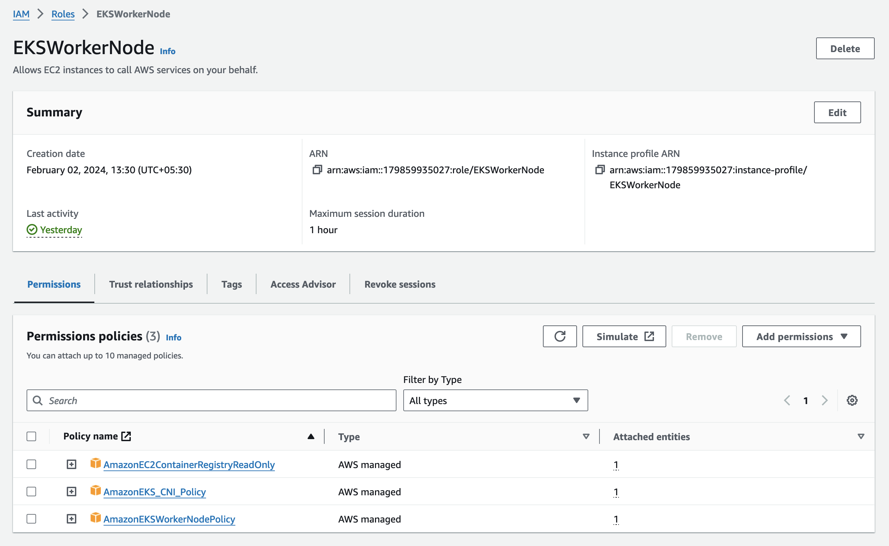
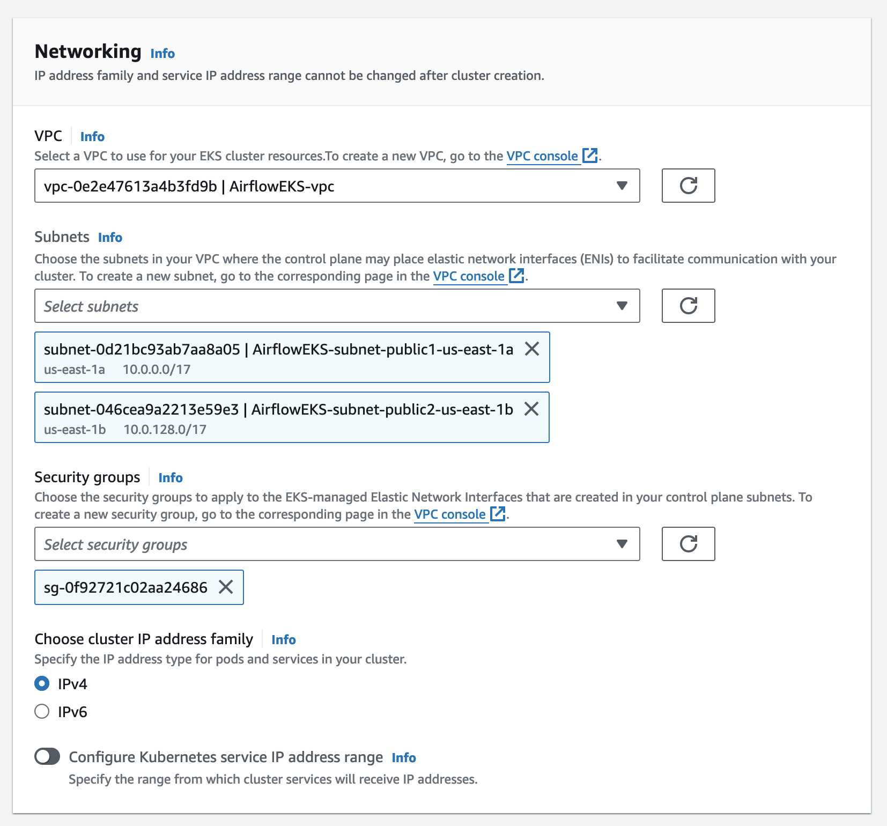
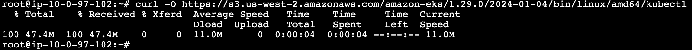
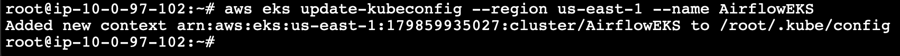
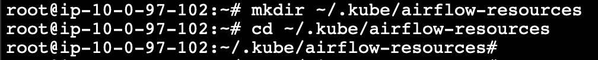
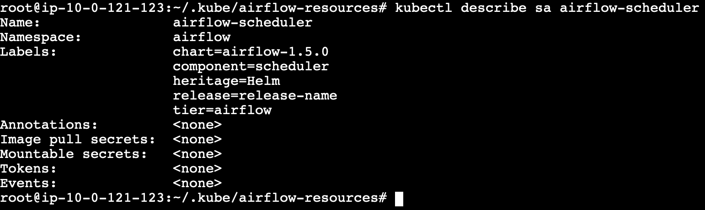
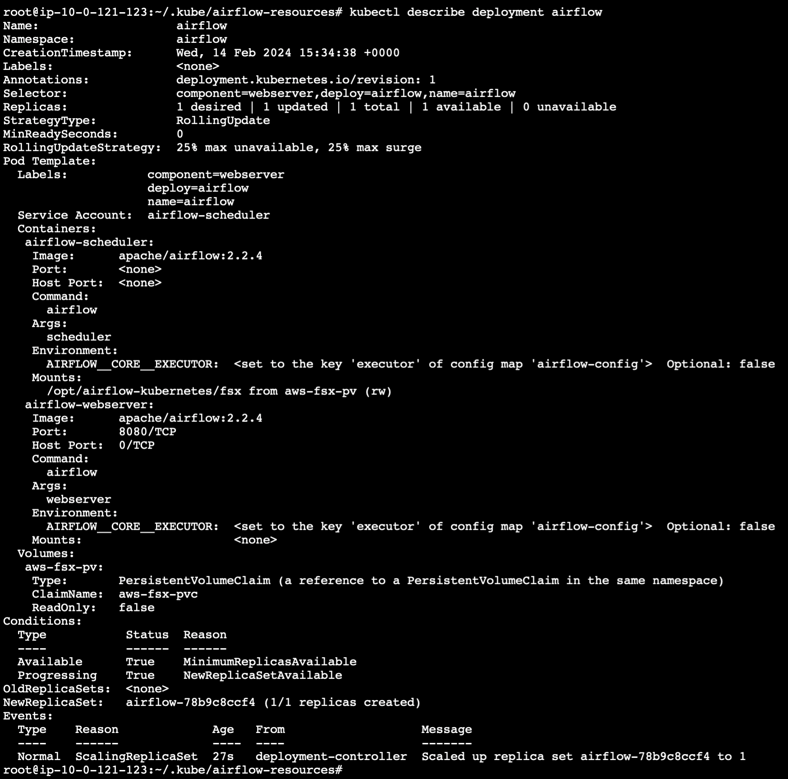
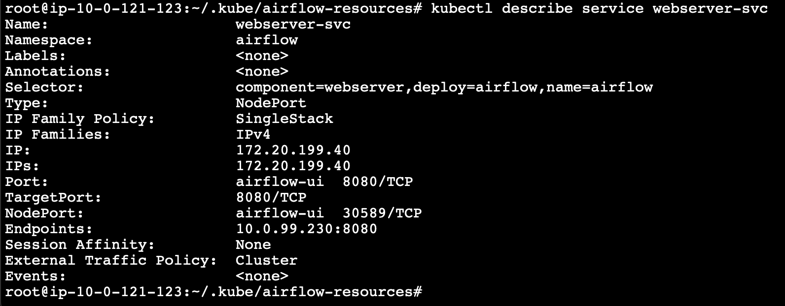

# Overview:

Apache Airflow is an open-source workflow management platform That is widely used among organizations across the globe. It uses an internal database to store all the metadata about running tasks and workflows. In the evolving technological landscape, every solution needs to be scalable to support the thinly spread enterprise architecture.

Airflow can be made scalable by deploying it on a Kubernetes cluster. In this article we will learn how deploy the airflow application in an AWS EKS cluster and persist the data by using an external storage like FSx Lustre.

# Prerequisites

The prerequisites for deploying the application on EKS cluster includes the following.
1.	IAM Roles for the Cluster and the worker nodes.
2.	VPC network setup.
3.	EKS cluster and Optional EC2 instance.
4.	FSx Lustre Filesystem

## IAM roles

The node IAM role gives permissions to the kubelet running on the node to make calls to other APIs on your behalf. This includes permissions to access container registries where your application containers are stored.
Before you can launch a node group, you must create an IAM role for those worker nodes to use when they are launched.
Create IAM roles for the EKS cluster and worker nodes.

a.	EKS_cluster_role with AWS managed policy AmazonEKSClusterPolicy
 

b.	EKSWorkerNode with AWS managed policies AmazonEC2ContainerRegistryReadOnly, AmazonEKS_CNI_Policy, and AmazonEKSWorkerNodePolicy


## VPC network setup

Create a VPC in your desired region. Make sure that the public subnets are enabled for auto assigning public IP address.

 
## Create EKS Cluster

An Amazon EKS cluster consists of two primary components:

1.	The Amazon EKS control plane which consists of control plane nodes that run the Kubernetes software, such as etcd and the Kubernetes API server. These components run in AWS owned accounts.
2.	A data plane made up of Amazon EKS worker nodes or Fargate compute registered to the control plane. Worker nodes run in customer accounts; Fargate compute runs in AWS owned accounts.

### Cluster configuration

Select the IAM role to allow the Kubernetes control plane to manage AWS resources on your behalf. This property cannot be changed after the cluster is created.
 

### Cluster access

By default, Amazon EKS creates an access entry that associates the AmazonEKSClusterAdminPolicy access policy to the IAM principal creating the cluster.
Any IAM principal assigned the IAM permission to create access entries can create an access entry that provides cluster access to any IAM principal after cluster creation.
The cluster will source authenticated IAM principals from both EKS access entry APIs and the aws-auth ConfigMap.

### Networking
Each Managed Node Group requires you to specify one of more subnets that are defined within the VPC used by the Amazon EKS cluster. Nodes are launched into subnets that you provide. The size of your subnets determines the number of nodes and pods that you can run within them. You can run nodes across multiple AWS availability zones by providing multiple subnets that are each associated different availability zones. Nodes are distributed evenly across all of the designated Availability Zones.
 
### Cluster endpoint access
You can limit, or completely disable, public access from the internet to your Kubernetes cluster endpoint.

Amazon EKS creates an endpoint for the managed Kubernetes API server that you use to communicate with your cluster (using Kubernetes management tools such as kubectl). By default, this API server endpoint is public to the internet, and access to the API server is secured using a combination of AWS Identity and Access Management (IAM) and native Kubernetes Role Based Access Control (RBAC).

You can, optionally, limit the CIDR blocks that can access the public endpoint. If you limit access to specific CIDR blocks, then it is recommended that you also enable the private endpoint, or ensure that the CIDR blocks that you specify include the addresses that worker nodes and Fargate pods (if you use them) access the public endpoint from.

You can enable private access to the Kubernetes API server so that all communication between your worker nodes and the API server stays within your VPC. You can limit the IP addresses that can access your API server from the internet, or completely disable internet access to the API server.

 

### Controller node setup
The controller node may be an EC2 machine or a bare metal computer where we install and configure AWS CLI, IAM authenticator, and Kubectl for accessing and making changes to the EKS cluster.
1.	AWS CLI
snap install aws-cli –classic

``` aws configure ```

 

2.	IAM Authenticator

```curl -o aws-iam-authenticator https://amazon-eks.s3.us-west-2.amazonaws.com/1.15.10/2020-02-22/bin/linux/amd64/aws-iam-authenticator```

Apply execute permissions to the binary. 

```chmod +x ./aws-iam-authenticator```

Copy the binary to a folder in your PATH.

```sudo mv ./aws-iam-authenticator /usr/local/bin```

Verify the installation

```aws-iam-authenticator help```
 

3.	Kubectl

Download the kubectl binary for your cluster's Kubernetes version from Amazon S3.
Kubernetes version on EKS cluster - 1.29
Instance architecture - Linux (amd64)

```curl -O https://s3.us-west-2.amazonaws.com/amazon-eks/1.29.0/2024-01-04/bin/linux/amd64/kubectl```

 

Apply execute permissions to the binary.

```chmod +x ./kubectl```

Copy the binary to a folder in your PATH.

```mkdir -p $HOME/bin && cp ./kubectl $HOME/bin/kubectl && export PATH=$HOME/bin:$PATH```

After you install kubectl, you can verify its version.

```kubectl version –client```

 

To configure the kubectl to communicate with the EKS cluster run the following command. Replace region-code with the AWS Region that your cluster is in. Replace my-cluster with the name of your cluster.

```aws eks update-kubeconfig --region region-code --name my-cluster```

 

Check the complete configuration of the kubectl by running the following command

```more /root/.kube/config```

 

Now upon running the following command, we should be able to see the services on our cluster.

```kubectl get svc```
 

### Create Worker Nodes

Create a node group on the EKS cluster’s compute tab.
A node group is a group of EC2 instances that supply compute capacity to your Amazon EKS cluster. You can add multiple node groups to your cluster.

 

1.	Node group configuration

Amazon EKS managed node groups make it easy to provision compute capacity for your cluster. Node groups consist of one or more EC2 instances running the latest EKS-optimized AMIs. All nodes are provisioned as part of an EC2 autoscaling group that is managed for you by Amazon EKS and all resources including EC2 instances and autoscaling groups run within your AWS account.
•	You can apply Kubernetes labels during node group creation and update them at any time.
•	Nodes are automatically tagged for auto-discovery by the Kubernetes cluster autoscaler.
 

2.	Node group compute configuration

Provision nodes for your cluster with the latest EKS-optimized AMIs. Easily update nodes to the latest AMI or Kubernetes versions when they are available.
Use launch templates to customize the configuration of the EC2 instances created as part of your node group.
 

3.	Node group scaling configuration

You can change the size of your node group at any time.
 

4.	Node group update configuration

Amazon EKS managed node groups supports updating nodes to newer AMI versions in parallel. By default, nodes are updated one at a time. However, if your applications can tolerate a higher level of disruption, you can decrease the overall time to complete a node group version update by increasing the parallelization level. You can increase this parallelization level by setting the node group maximum number of unavailable nodes, either as an absolute number, or as a percentage of the node group size. 


5.	Node group network configuration

Select multiple subnets for a node group to provision nodes across multiple AWS availability zones.
 

Now we can see the list of nodes created under this node group by running the following command.

```kubectl get nodes```

 

Also, we can see the node in the EC2 console with the same private IP address as found in the above screenshot.

 


## Create FSx
The type of file system we choose is Amazon FSx for Lustre as it is cost-effective, scalable and high-performing file storage for compute workloads like airflow.

 

### File system details
Persistent file systems are ideal for longer-term storage and workloads. Data is replicated and file servers are replaced if they fail.

Scratch file systems are ideal for temporary storage and shorter-term processing of data. Data is not replicated and does not persist if a file server fails.

Choose SSD storage for latency-sensitive workloads or workloads requiring the highest levels of IOPS/throughput.

Choose HDD storage for throughput-focused workloads that aren’t latency-sensitive. For HDD-based file systems, the optional SSD cache improves performance by automatically placing your most frequently read data on SSD (the cache size is 20% of your file system size).

Throughput per unit of storage represents the throughput that will be available per TiB of provisioned storage. Total throughput for your file system is this value multiplied by storage capacity.
 

### Network & security
The VPC Security Groups associated with your file system’s network interfaces determine which compute instances can access your file system. If you don’t select a VPC Security Group, Amazon FSx will automatically associate your VPC’s default Security Group with your file system’s network interfaces.

 

The provided security groups do not permit Lustre LNET network traffic on port 988 for the file system to be created.

 

# Deploying Apache Airflow on a Kubernetes Cluster
## Install the FSx CSI Driver
To use the FSx as a persistence volume on a EKS cluster, the IAM Role that is attached to the cluster must have the permission to access the FSx with read and write permission. This can be achieved by adding the following IAM policy the cluster role.
```
{
  "Version": "2012-10-17",
  "Statement": [
    {
      "Effect": "Allow",
      "Action": [
        "iam:CreateServiceLinkedRole",
        "iam:AttachRolePolicy",
        "iam:PutRolePolicy"
       ],
      "Resource": "arn:aws:iam::*:role/aws-service-role/fsx.amazonaws.com/*"
    },
    {
      "Effect": "Allow",
      "Action": [
        "fsx:*"
      ],
      "Resource": ["*"]
  }]
}
```
Once you have the policy added your instance IAM role, you can start to deploy the FSx CSI driver. This will deploy a StatefulSet, a DaemonSet, and all the RBAC rules needed to allow the FSx CSI Driver to manage your storage:


```$kubectl create -k "github.com/kubernetes-sigs/aws-fsx-csi-driver/deploy/kubernetes/overlays/stable/?ref=master"```

 

## Namespace for airflow deployment

There will be few namespaces created by default in the EKS cluster. Those can be listed using the following command.

```kubectl get ns```

 

We can create a custom namespace for the Airflow.

```kubectl create namespace airflow```

```kubectl get ns```

 

Going further we are going to use this namespace for installing the airflow. Hence, we can set this namespace as default by using the following command.

```kubectl config set-context --current --namespace=airflow```

We can also avoid this step and use ```-n airflow``` at the end of each command which need to do anything with our namespace.

Note: Once the application installation is completed, the default configuration setting must be reset. Else, all the future process will be done in the same namespace.

## Preparing resources for airflow deployment
Create a path for managing the airflow resources.
```
mkdir ~/.kube/airflow-resources
cd ~/.kube/airflow-resources
```
 

### Storageclass

Create the Storage class configuration file in the name airflow-storageclass.yaml. Where the subnet and the security group used to create the FSx must be mentioned

Apply the storage class using the following command.

```kubectl apply -f airflow-storageclass.yaml```

Check the storage class using the following command.

```kubectl describe sc aws-fsx-sc```


### Persistent Volume Claim
Create the persistent volume claim configuration file for the FSX in the name persistent-volume-claim.yaml.

Apply the volume claim using the following command.

```kubectl apply -f persistent-volume-claim.yaml```

Check the volume claim configuration using the following command.

```kubectl describe pvc aws-fsx-pvc```
 

### Config Map
Create config map configuration file in the name airflow-configmap.yaml.

Apply the config map using the following command.

```kubectl apply -f airflow-configmap.yaml```

Check the config using the following command.

```kubectl describe configmap airflow-config ```


### Scheduler

Create the scheduler configuration for Airflow in the name scheduler-serviceaccount.yaml.

Apply the scheduler configurationusing the following command

```kubectl apply -f scheduler-serviceaccount.yaml```


Check the scheduler configuration using the following command.

```kubectl describe sa airflow-scheduler ```



### Pod Launcher Role and Role Binding
Create the Pod launcher role in the name pod-launcher-role.yaml as shown below.

Create the pod launcher role binding in the name pod-launcher-role-binding.yaml.

Apply the role and role binding configurations using the following commands.

```
kubectl apply -f pod-launcher-role.yaml
kubectl apply -f pod-launcher-role-binding.yaml
```
Check the configuration of the role and role binding using the following commands.
```
kubectl describe role pod-launcher-role
kubectl describe role pod-launcher-role-binding
```


### Deployment
Now that all our prerequisites and the cluster resources are ready, we are going to create our deployment file for the airflow in the name airflow-deployment.yaml.

Deploy the airflow webserver by applying the deployment configuration using the following command.

```kubectl apply -f airflow-deployment.yaml```

The entire configuration of the airflow deployment including all that we applied earlier can be checked now using the following command.

```kubectl describe deployment airflow ``



To check the status of the pods running in the deployment, use the following command.

```kubectl get pods```

### Service

We need to create a Kubernetes service for the airflow webserver. The YAML file to create the webserver service with the defined network port is called airflow-service.yaml

Now we can create the webserver service using the following command.

```kubectl apply -f airflow-service.yaml ```

And check the details of the webserver using the following command.

```kubectl describe service webserver-svc```



Airflow is finally deployed on the Kubernetes cluster and is running successfully, we can open the Airflow webserver UI using the cluster endpoint.


